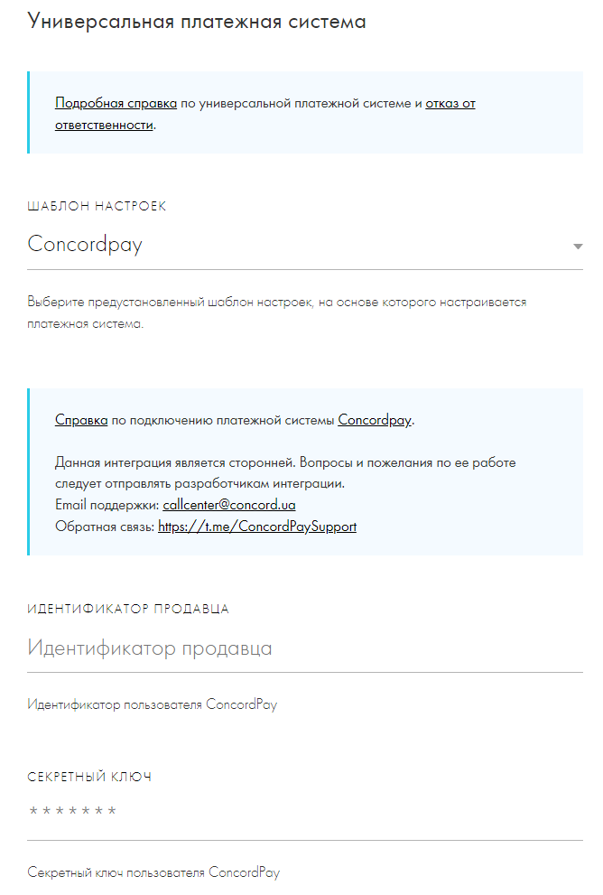
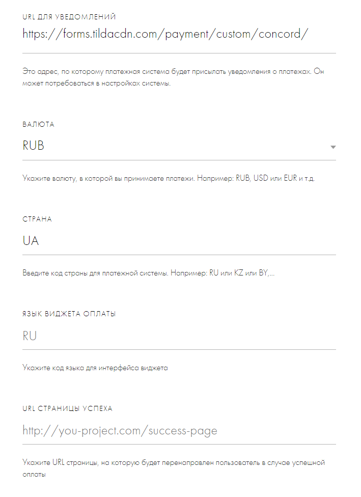
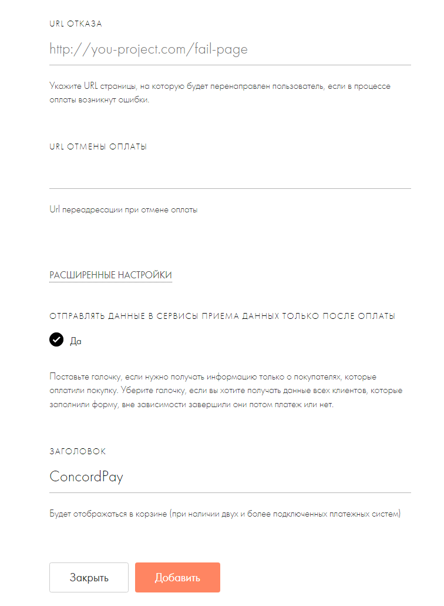

# Модуль ConcordPay для Tilda

Creator: [ConcordPay](https://concordpay.concord.ua) 
Tags: ConcordPay, Tilda, payment, payment gateway, credit card, Visa, Masterсard, Apple Pay, Google Pay 
License: GNU GPL v3.0 
License URI: [License](https://opensource.org/licenses/GPL-3.0)

Этот модуль позволит вам принимать платежи через платёжную систему **ConcordPay**.

## Установка

1. Перейдите в *«Настройки сайта -> Платежные системы -> Универсальная платёжная система»*.

2. Система предложит вам выбрать шаблон для интеграции или создать свой. Выберите шаблон **ConcordPay**.

3. Укажите параметры вашего продавца, полученные от платёжной системы:
   - *Идентификатор продавца*;
   - *Секретный ключ*;
   - *Валюта*.

     
4. Настройки URL-адресов, на которые будет перенаправляться покупатель по результатам платежа, остаются на ваше усмотрение.

Сохраните настройки.

Модуль готов к работе.
